# UNets
Pytorch implementation of u-nets.

## Command lines
- train
  ```
  python train_regression.py --train-image-path ./data/ny_hei_train.txt \
                             --val-image-path ./data/ny_hei_val.txt
  ```
  
## Results
- L1 loss

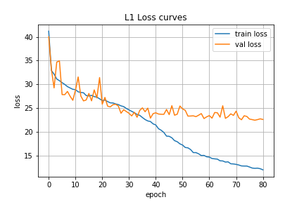

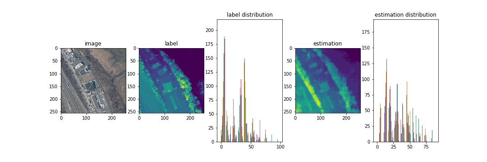
<!--- 
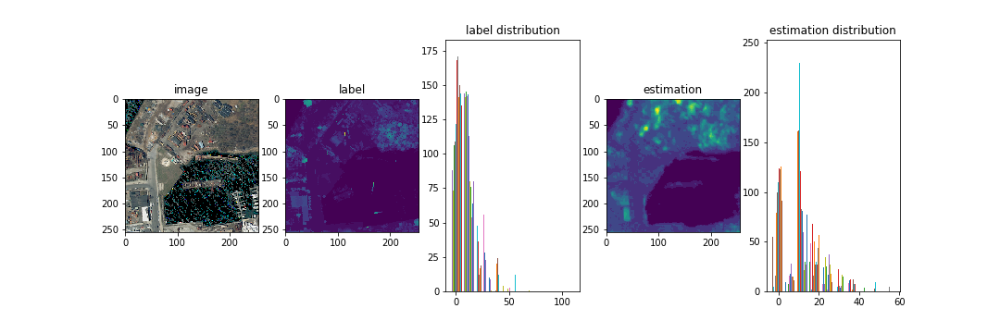
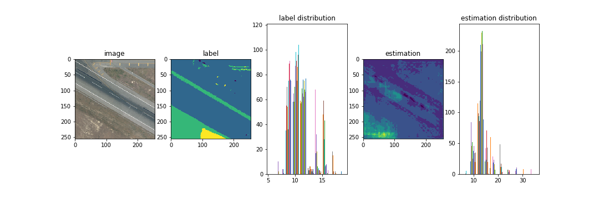

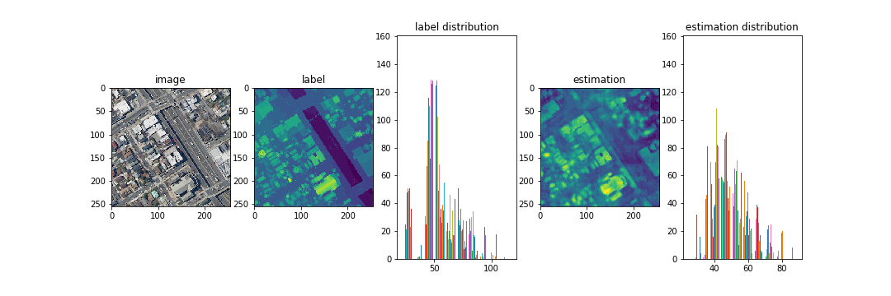
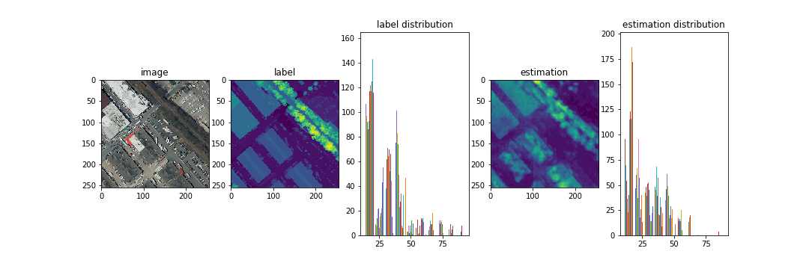
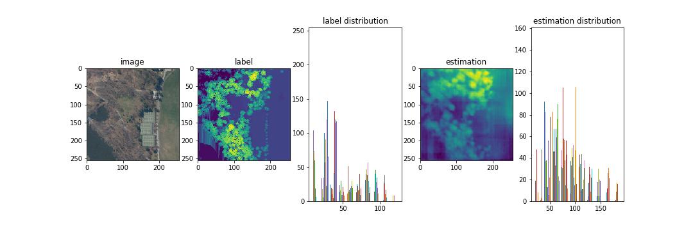
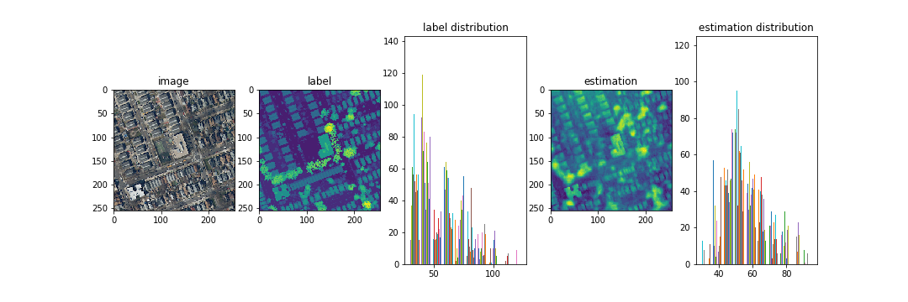
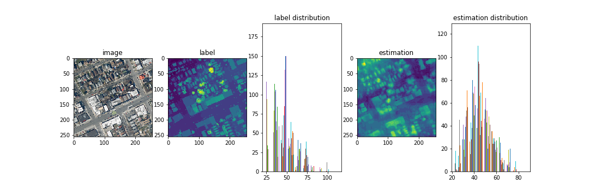
-->

- L2 loss


<!--- 

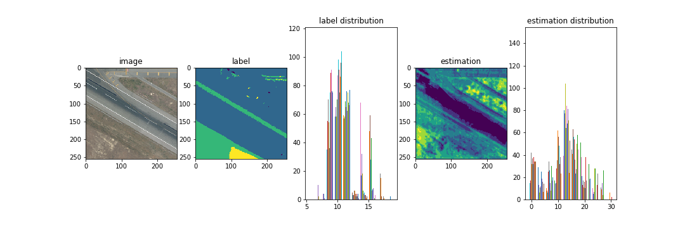

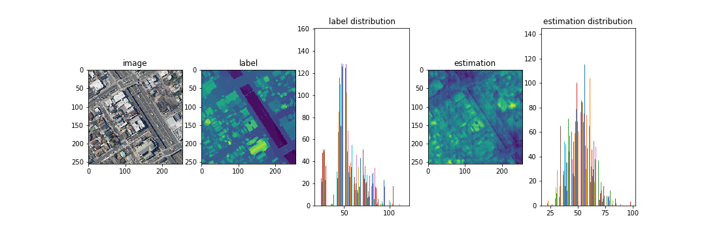

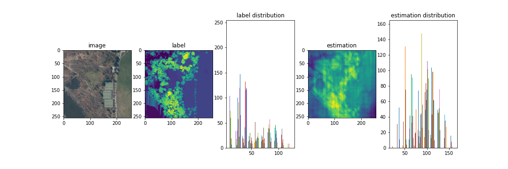

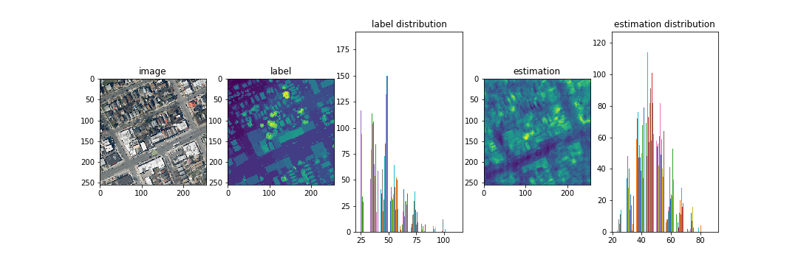
-->

## Papers
### U-Net
- [U-Net: Convolutional Networks for Biomedical Image Segmentation (*MICCAI, 2015*)](https://arxiv.org/pdf/1505.04597.pdf)
- [U-Net: deep learning for cell counting, detection, and morphometry (*NATURE METHODS, 2019*)](https://www.researchgate.net/publication/329716031_U-Net_deep_learning_for_cell_counting_detection_and_morphometry)
- [UNet++: A Nested U-Net Architecture for Medical Image Segmentation (*2018*)](https://arxiv.org/pdf/1807.10165.pdf)
### U-Net with attention
- [Attention U-Net: Learning Where to Look for the Pancreas (*MIDL, 2018*)](https://arxiv.org/pdf/1804.03999.pdf)
### Cascaded U-Net
- [Glioma Segmentation with Cascaded Unet (*2018*)](https://arxiv.org/pdf/1810.04008.pdf)

### Dice Loss
- [Generalised Dice overlap as a deep learning loss function for highly unbalanced segmentations (*2017*)](https://arxiv.org/pdf/1707.03237.pdf)
- [V-Net: Fully Convolutional Neural Networks for Volumetric Medical Image Segmentation *(2016)*](https://arxiv.org/pdf/1606.04797.pdf)

## References
https://github.com/milesial/Pytorch-UNet/tree/master/unet
